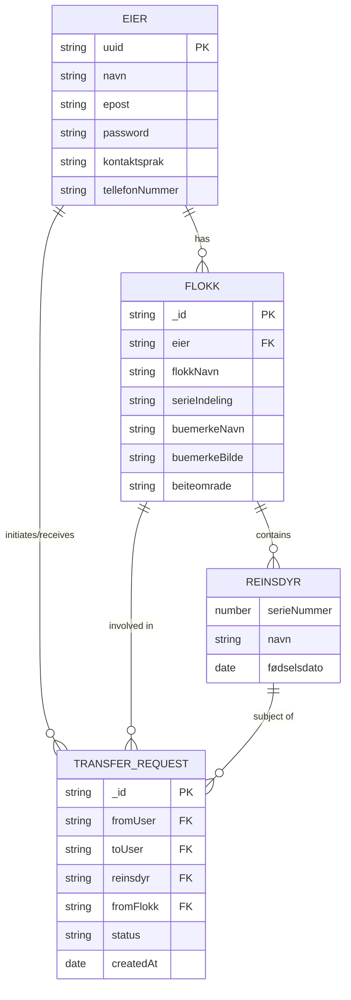

# ReinsdyrOppgave

## er-diagram


## API Documentation

### Authentication

#### Register a new user
- **URL:** `/auth/register`
- **Method:** `POST`
- **Description:** Registers a new user.
- **Request Body:**
    ```json
    {
        "navn": "string",
        "epost": "string",
        "password": "string",
        "repeatPassword": "string",
        "kontaktsprak": "string",
        "tellefonNummer": "string"
    }
    ```
- **Response:** Redirects to the login page.

#### Login
- **URL:** `/auth/login`
- **Method:** `POST`
- **Description:** Logs in a user.
- **Request Body:**
    ```json
    {
        "epost": "string",
        "password": "string"
    }
    ```
- **Response:** Redirects to the home page.

### Flock Management

#### Add a new flock
- **URL:** `/flokk/add`
- **Method:** `POST`
- **Description:** Adds a new flock.
- **Request Body:**
    ```json
    {
        "flokkNavn": "string",
        "buemerkeNavn": "string",
        "buemerkeBilde": "file",
        "beiteomrade": "string"
    }
    ```
- **Response:** Redirects to the profile page.

#### Get profile
- **URL:** `/flokk/profil`
- **Method:** `GET`
- **Description:** Retrieves the profile of the logged-in user.
- **Response:** Renders the profile page.

#### Get reindeer in a flock
- **URL:** `/flokk/:flokkId/reinsdyr`
- **Method:** `GET`
- **Description:** Retrieves the reindeer in a specific flock.
- **Response:** Renders the reindeer list page.

#### Transfer reindeer
- **URL:** `/flokk/transfer-reinsdyr`
- **Method:** `POST`
- **Description:** Transfers a reindeer from one flock to another.
- **Request Body:**
    ```json
    {
        "fromFlokkId": "string",
        "toFlokkId": "string",
        "reinsdyrId": "string"
    }
    ```
- **Response:** Redirects to the profile page.

### Reindeer Management

#### Register a new reindeer
- **URL:** `/reinsdyr/RegistrerReinsdyr`
- **Method:** `POST`
- **Description:** Registers a new reindeer.
- **Request Body:**
    ```json
    {
        "flokkId": "string",
        "serieNummer": "number",
        "navn": "string",
        "fødselsdato": "date"
    }
    ```
- **Response:** Redirects to the home page.

### Transfer Management

#### Initiate a transfer
- **URL:** `/transfer/initiate-transfer`
- **Method:** `POST`
- **Description:** Initiates a transfer request for a reindeer.
- **Request Body:**
    ```json
    {
        "toUserEmail": "string",
        "reinsdyrId": "string",
        "flokkId": "string"
    }
    ```
- **Response:** Redirects to the profile page.

#### Accept a transfer
- **URL:** `/transfer/accept-transfer`
- **Method:** `POST`
- **Description:** Accepts a transfer request.
- **Request Body:**
    ```json
    {
        "requestId": "string"
    }
    ```
- **Response:** Redirects to the profile page.

#### Decline a transfer
- **URL:** `/transfer/decline-transfer`
- **Method:** `POST`
- **Description:** Declines a transfer request.
- **Request Body:**
    ```json
    {
        "requestId": "string"
    }
    ```
- **Response:** Redirects to the profile page.

#### Confirm a transfer
- **URL:** `/transfer/confirm-transfer`
- **Method:** `POST`
- **Description:** Confirms a transfer request.
- **Request Body:**
    ```json
    {
        "requestId": "string"
    }
    ```
- **Response:** Redirects to the profile page.

### Miscellaneous

#### Home Page
- **URL:** `/`
- **Method:** `GET`
- **Description:** Retrieves the home page with a list of reindeer.
- **Response:** Renders the home page.

#### FAQ Page
- **URL:** `/FAQ`
- **Method:** `GET`
- **Description:** Retrieves the FAQ page.
- **Response:** Renders the FAQ page.

#### Language Map Page
- **URL:** `/kartSide`
- **Method:** `GET`
- **Description:** Retrieves the language map page.
- **Response:** Renders the language map page.

#### Database Explanation Page
- **URL:** `/DBforklaring`
- **Method:** `GET`
- **Description:** Retrieves the database explanation page.
- **Response:** Renders the database explanation page.